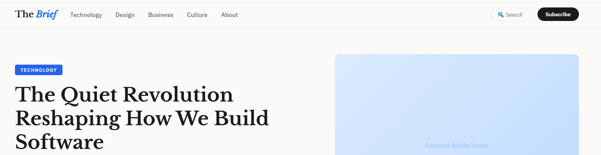
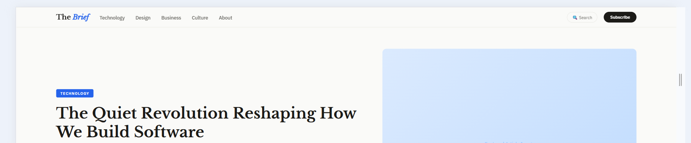

# 📝 Blog Page

A responsive blog website built with HTML, CSS, and JavaScript.

## 🌐 Live Demo
[View Live](https://jinaljain733-cmd.github.io/blog-page)

## 📸 Preview

### 💻 Desktop View


### 📱 Mobile View


## 🛠️ Tech Stack
- HTML5
- CSS3
- JavaScript

## ✨ Features
- Clean and readable blog layout
- Responsive design for all screen sizes
- Article cards with thumbnails
- Navigation menu

## 📁 Project Structure

blog-page/
├── index.html
├── style.css
└── script.js


## 🚀 Getting Started
1. Clone the repo:
```bash
git clone https://github.com/jinaljain733-cmd/blog-page.git
Open index.html in your browser
👤 Author

Jinal Jain

GitHub: @jinaljain733-cmd
📄 License

This project is open source and available under the MIT License.