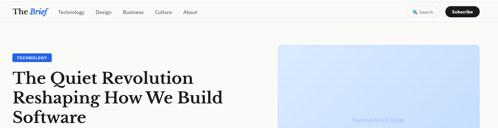
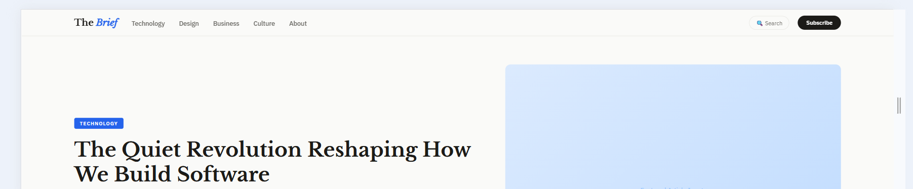

# 📰 Blog Page — The Brief


A clean, modern and fully responsive blog website built with pure HTML, CSS and JavaScript — no frameworks, no dependencies.

---

## 🌐 Live Demo

**[https://jinaljain733-cmd.github.io/blog-page](https://jinaljain733-cmd.github.io/blog-page)**

---

## 📸 Preview

### 💻 Desktop View


### 📱 Mobile View


---

## ✨ Features

- Sticky frosted-glass navigation bar with `backdrop-filter: blur()`
- Featured hero post with author info and read time
- Horizontal post cards with thumbnails, categories and excerpts
- Filter buttons (All / Design / Tech / Business)
- Newsletter signup widget in sidebar
- Popular posts sidebar with read counts
- Browse topics tag cloud
- Pagination controls
- Multi-column footer with social links
- Fully responsive across all screen sizes (1024px / 768px / 560px)
- Zero JavaScript dependencies — pure CSS interactions

---

## 🛠️ Tech Stack

| Technology | Usage |
|---|---|
| HTML5 | Semantic structure (`<nav>`, `<main>`, `<aside>`, `<footer>`) |
| CSS3 | Grid, Flexbox, Variables, `clamp()`, `backdrop-filter` |
| JavaScript | Filter button interactions |
| Google Fonts | Libre Baskerville + IBM Plex Sans |

---

## 🧠 CSS Concepts Used

- CSS Custom Properties (variables)
- CSS Grid — featured layout, main+sidebar, footer
- Flexbox — nav, post meta, pagination
- `clamp()` — fluid responsive typography
- `backdrop-filter: blur()` — frosted glass nav effect
- `-webkit-line-clamp` — 2-line text truncation on excerpts
- `position: sticky` — navbar stays on scroll
- `scroll-behavior: smooth` — smooth anchor navigation
- Linear gradients — placeholder image backgrounds
- CSS transitions — hover effects on links and buttons

---

## 📁 Project Structure

```
blog-page/
├── index.html       # Main HTML file (all-in-one)
├── image.png        # Desktop screenshot
├── image-1.png      # Mobile screenshot
└── README.md
```

---

## 🚀 Getting Started

```bash
# Clone the repo
git clone https://github.com/jinaljain733-cmd/blog-page.git

# Go into the folder
cd blog-page

# Open in browser
open index.html
```

Or just open `index.html` directly — no install needed.

---

## 📱 Responsive Breakpoints

| Breakpoint | Layout Change |
|---|---|
| `≤ 1024px` | Sidebar moves below main content |
| `≤ 768px` | Featured section stacks, post cards go single column |
| `≤ 560px` | Nav links hidden, footer goes single column |

---

## 👤 Author

**Jinal Jain**
- GitHub: [@jinaljain733-cmd](https://github.com/jinaljain733-cmd)
- LinkedIn: [linkedin.com/in/jinal-jain-08b70328b](https://linkedin.com/in/jinal-jain-08b70328b)

---

## 📄 License

This project is open source and available under the [MIT License](LICENSE).

> ⚠️ Please do not reuse or redistribute this project as your own work.